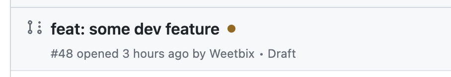
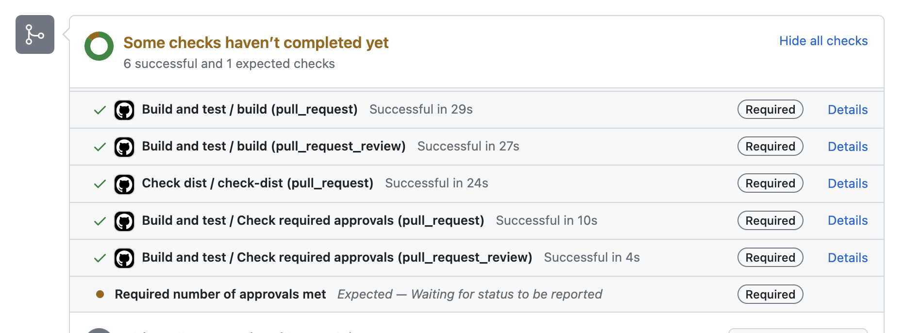
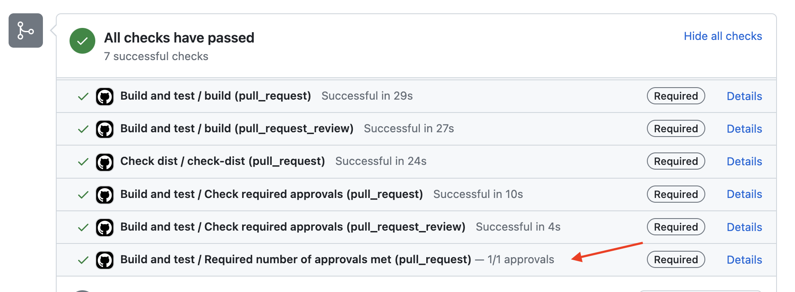

# Configurable Required Approvals GitHub Action

This GitHub Action checks if specific files in a pull request have the required number of approvals.
It allows you to define groups of files using glob patterns and specify the minimum number of approvals required for each group.

## Why

GitHub only lets you set the required number of approvals on a global level. In a monorepo, we may have sensitive projects which
require more than 1 reviewer, and we dont want to force multiple approvals on all of the monorepo.

With this action, you can set paths and approval requirements based on file change globs, and then make this check required.

## How

In order to avoid pull requests showing a red ❌ when the required approvals are not met (which may deter futher reviewers),
this action always succeeds. If the approval requirements are met, the action will **add an additional check to the pull request
with the name "Required number of approvals met"**.

If the required approvals are not met, the additional status check will _not be added_, and the PR will show in a pending state.

Users of this action should set this additional check (`Required number of approvals met`) as required in the branch protection settings.

### Example of a PR without the required approvals




### Example of a PR with required approvals and check



### Pitfalls

When there are multiple workflows running in parallel, the check will be randomly attached
to one of the workflows, instead of the originating workflow.

If you want to fix this, you must use a GitHub App token. See for example: https://github.com/LouisBrunner/checks-action/issues/26#issuecomment-1232948025

## Usage

Here's an example workflow configuration:

```yaml
name: Required Approvals

on:
  pull_request:
  pull_request_review:

permissions:
  checks: write
  pull-requests: read

jobs:
  required-approvals:
    runs-on: ubuntu-latest

    steps:
      - name: Check required approvals
        uses: weetbix/configurable-required-approvals@v1
        with:
          requirements: |
            - patterns:
                - "frontend/packages/kinda-sensitive/**/*"
                - "frontend/packages/kinda-sensitive-2/**/*"
              requiredApprovals: 2
            - patterns:
                - "very-sensitive/**/*"
              requiredApprovals: 3
          github-token: ${{ secrets.GITHUB_TOKEN }}
```

You would then make `Required number of approvals met` a required check in the repository's branch protection.

## Inputs

- `requirements`: A YAML-formatted list of requirements. Each requirement consists of `patterns` (an array of glob patterns) and `requiredApprovals` (the minimum number of approvals required). Example:

  ```yaml
  requirements: |
    - patterns:
        - "frontend/packages/cool-app/**/*"
      requiredApprovals: 2
    - patterns:
        - "backend/**/*"
        - "shared/**/*"
      requiredApprovals: 3
  ```

- `github-token` (required): The GitHub token used to authenticate API requests. You can use the `${{ secrets.GITHUB_TOKEN }}` secret token provided by GitHub.

## Behavior

- If none of the files in the specified patterns are touched in the pull request, the action sets the custom check.
- If files in the specified patterns are touched, the action checks if the pull request has the required number of approvals.
- If the required number of approvals is not met, the action does not set the custom check.
- Always succeed on the `pull_request` event when there are no reviews yet, so that you can set this check as `required` in branch protection.